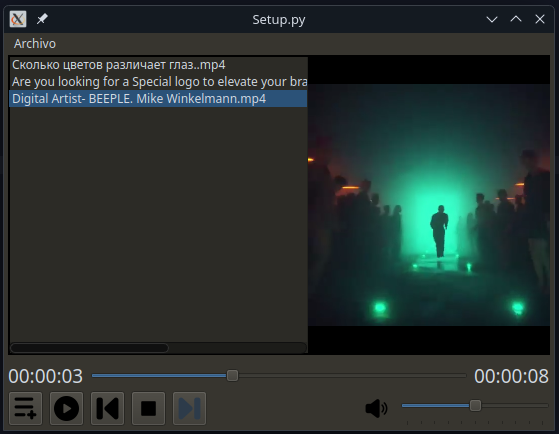

# Video Player

**reproductor v2** : fork de https://github.com/crostow/reproductor_v2

## Notas

CAMBIOS A LA INTERFAZ

- he creado variables para asignar el tamaño de los botones de los controles para que se ajuste a los widgets que los contienen (tamaños, espaciado y margenes)
- centrar el icono del volumen
- agregue una funcion para asignar color de fondo al player, controles y al menubar
- cambie el tamaño de la fuente de los labels del tiempo
- cambie el estilo del scrollbar horizontal de la playlist
- he creado un archivo `qss` para colocar los estilos y estos esten mas ordenados, ademas de la funcion para leer y aplicarlo
- cambie el nombre de algunas variable que use para modificar los margenes entre los widgets
- se puede quitar los estilos solo commentando las linea `setModicationsSkin` y `setBackgroundColor`

