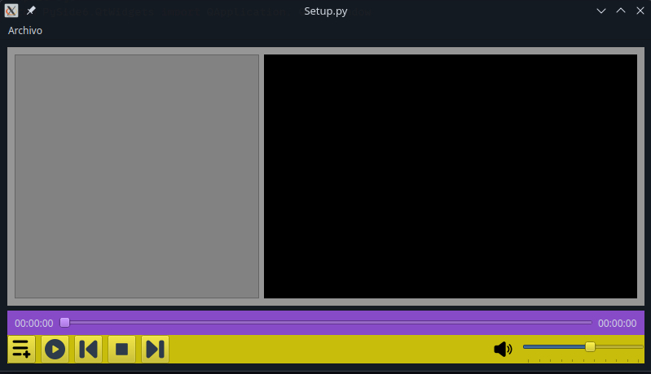

# Video Player

**reproductor v2** : fork de https://github.com/crostow/reproductor_v2

## Notas

CAMBIOS A LA INTERFAZ

- he creado variables para asignar el tamaño de los botones de los controles para que se ajuste a los widgets que los contienen (tamaños, espaciado y margenes)
- centrar el icono del volumen
- agregue una funcion para asignar color de fondo al player, controles y al menubar
-